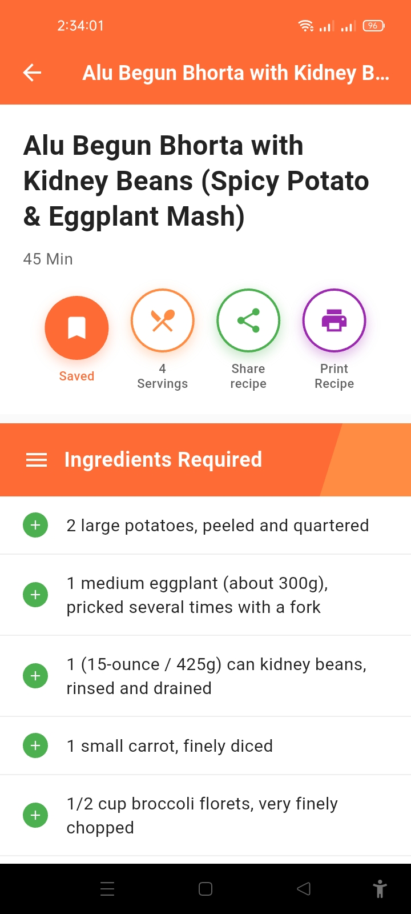
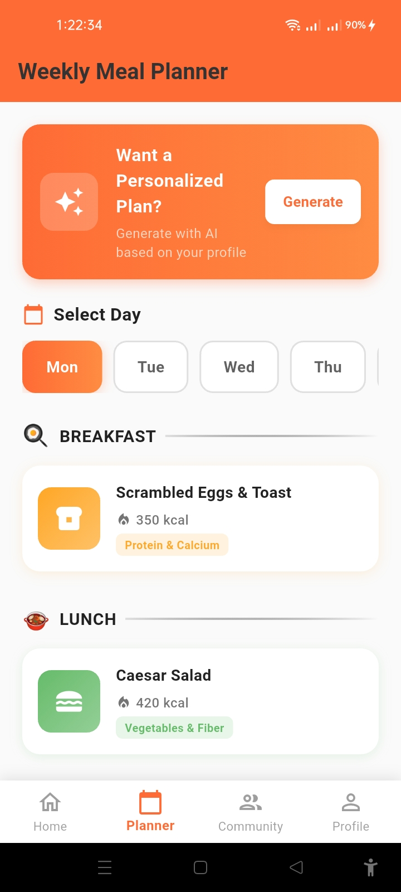
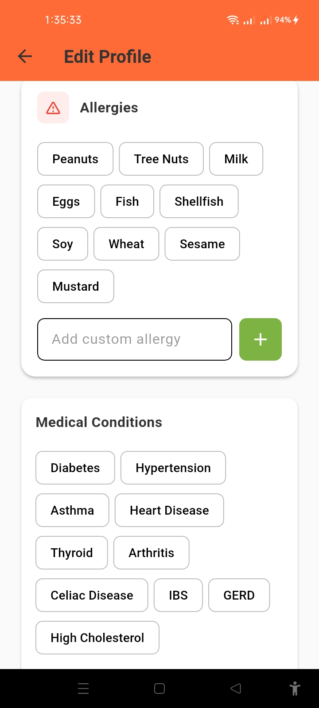

# 🍳 Yummate – AI Powered Recipe Generator App

Yummate is an AI-powered mobile application that generates recipes based on available ingredients. 
It helps users cook smarter, reduce food waste, and plan meals efficiently.

---

## 🚀 Features
- Generate recipes from available ingredients
- Image-based ingredient recognition
- AI-powered personalized recipe suggestions
- Smart meal planning
- Community interaction
- Offline access to saved recipes

---

## 🧠 Technologies Used
- Flutter (Mobile App Development)
- Firebase Authentication
- Gemini AI (Recipe Generation)
- Image Recognition AI
- REST APIs

---

## 📱 App Screenshots
|---------|----------|----------|
|  |  |  |
|  |  |  |
|  |  |  | 
|  |  | |

<!--  -->

---

## 🛠️ Installation & Setup 
Follow the steps below to run the Yummate app locally on your machine.

### ✅ Prerequisites
Make sure you have the following installed:
- Flutter SDK (latest stable version)
- Dart SDK
- Android Studio or VS Code
- Android Emulator or Physical Device
- Git (optional but recommended)

1. Check Flutter installation:
    ```bash
    flutter --version
2. Clone the repository  
   ```bash
   https://github.com/ShantoGUB567/Recipe-Recommendation-App.git
3. Navigate into the project directory:
    ```bash
    cd yummate
4. 
5. 
6. 
7. 
8. 
9. 
10. 


